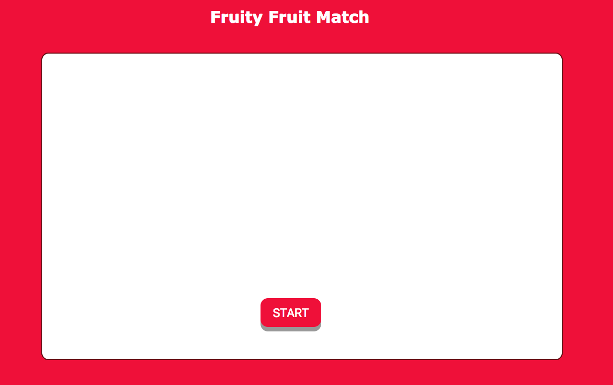
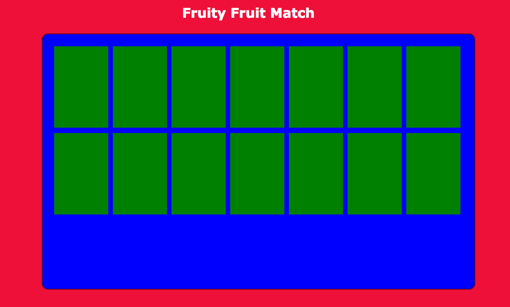
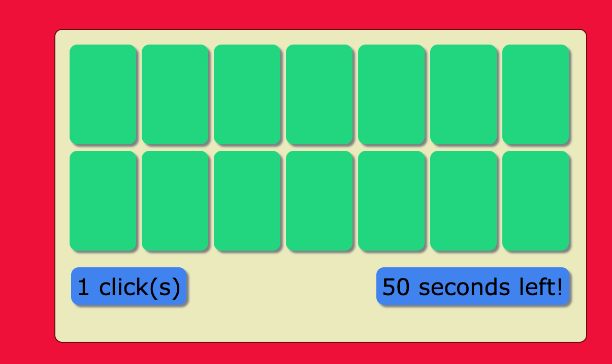
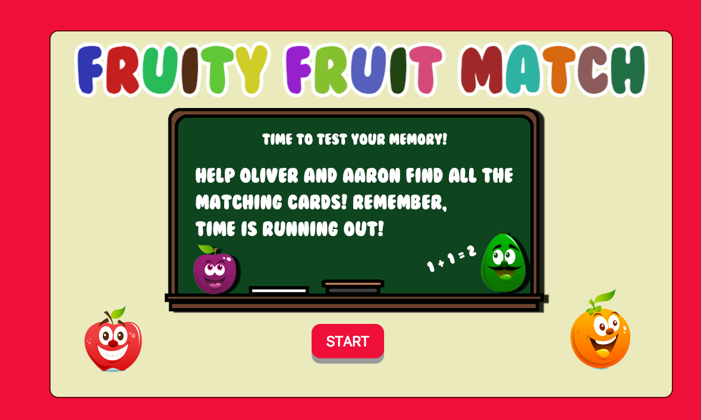
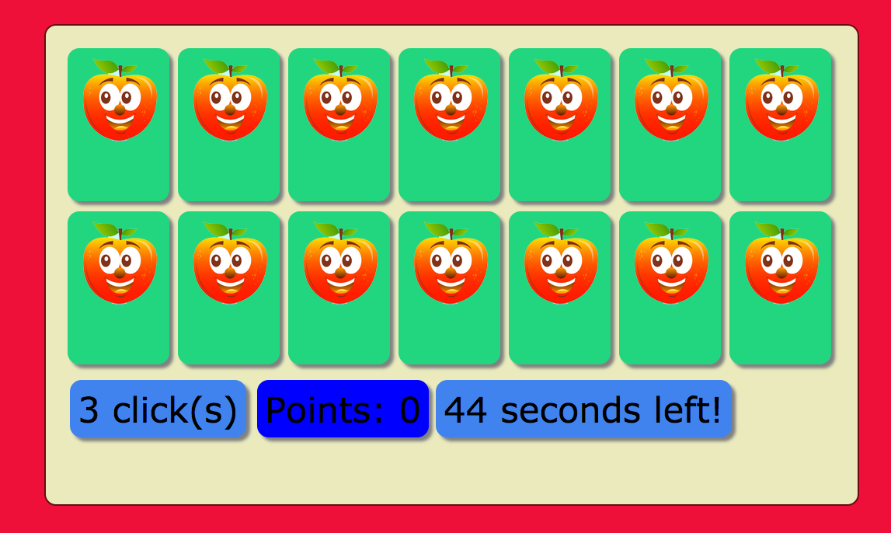
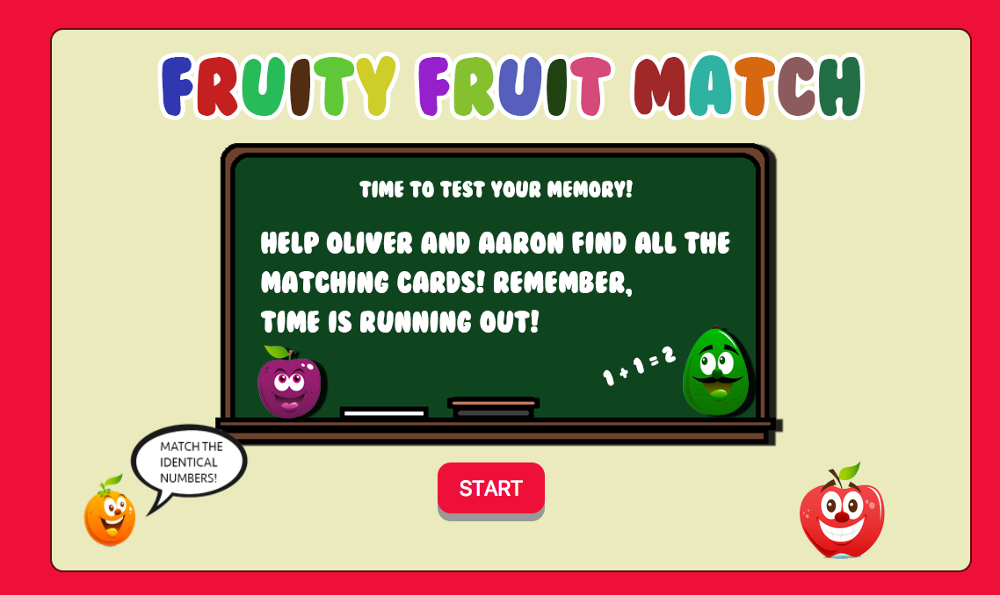
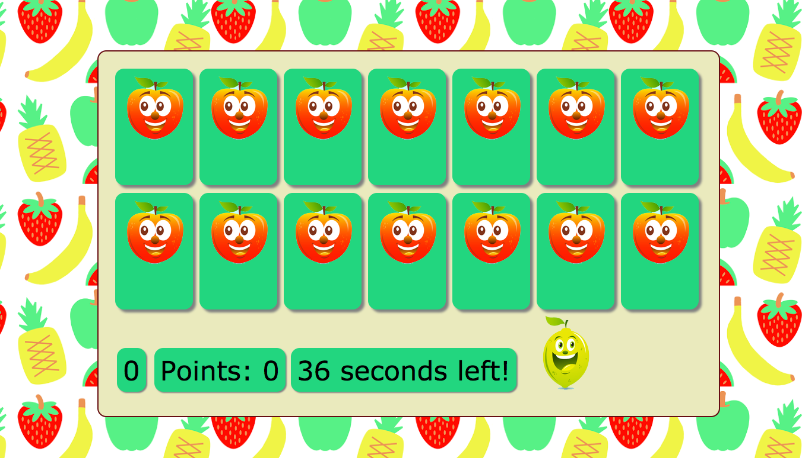
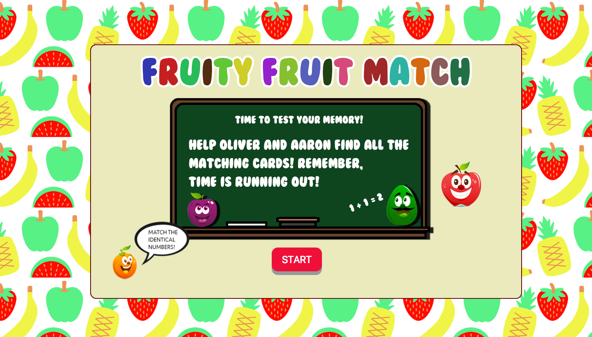

# Memory Game - Fruity Fruit Match

A fruit themed memory card game that requires the user to find 2 of the same matching cards in order to gain a point. A timer counting down from 60 seconds is included to provide a challenge. If the timer hits 0 and the player hasn't completed the game, they are prompted with a game over screen and can replay. Furthermore, the players clicks are tracked in order to allow the user to analyse how well they are doing. The fewer clicks the better. 

# Target Audience 

Although the game is simple enough to be played by everyone, the game aesthetics is target audience for younger players.

# Functionality and Implementation 

This memory card game is a simple web hosted application with sound, interactivity and animation. The game was created using HTML CSS and JQUERY. Below is a link to the Demo site: 

//link here 

For cloning/downloading the project - Please open the Index.HTML file with your favourite Internet browser (Google Chrome is recommended).

# Planning

Before I began coding, I did some planning. Important elements such as layout and game play needed to be decided on before I moved on to development. Having a plan allowed me to always refer back to my plan once one major aspect was completed.

//include here images of photoshop initial plan 

<!-- ## Development

Below are the first stages of development. The home screen and play screen. 

I then began adding more features and decided on a theme.

Added styling and improved aesthetics.

<!-- 
 -->

<!-- Final out come for home and play screens. -->

<!-- 
 --> <!-- --> -->

# Credits 

It's about time to mention resources (and people behind them) that helped me to create my game.

Sounds from Freesounds.org & Bensound.com 

Background Music - [Funny Song by BenSound](https://www.bensound.com/royalty-free-music/track/funny-song)

Sound Effects - [Card Matched Sounds](http://freesound.org/people/paep3nguin/sounds/388047/)
				[Game Completed Sound](http://freesound.org/people/paep3nguin/sounds/388046/)
				[Game Completed Sound](http://freesound.org/people/ZenithInfinitiveStudios/sounds/343003/)
				[Game Over Sound](http://freesound.org/people/fins/sounds/133283/)

Images -[Fruits](http://www.freepik.com/premium-vector/cartoon-fruits_785794.htm)
		[Game over image](https://www.redbubble.com/people/peppermintpopuk/works/14838397-cute-sad-apple?p=sticker)
		[Body Background Image](http://payload221.cargocollective.com/1/11/367274/6736242/FruitPatternBigWebBackground.png)

